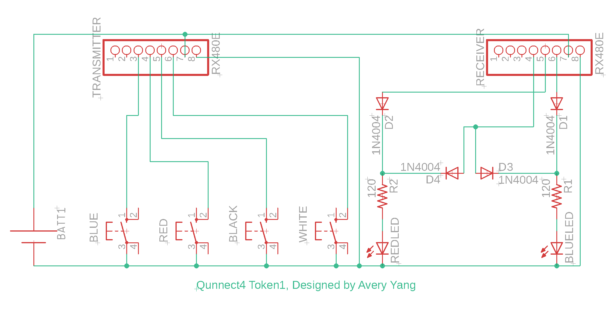
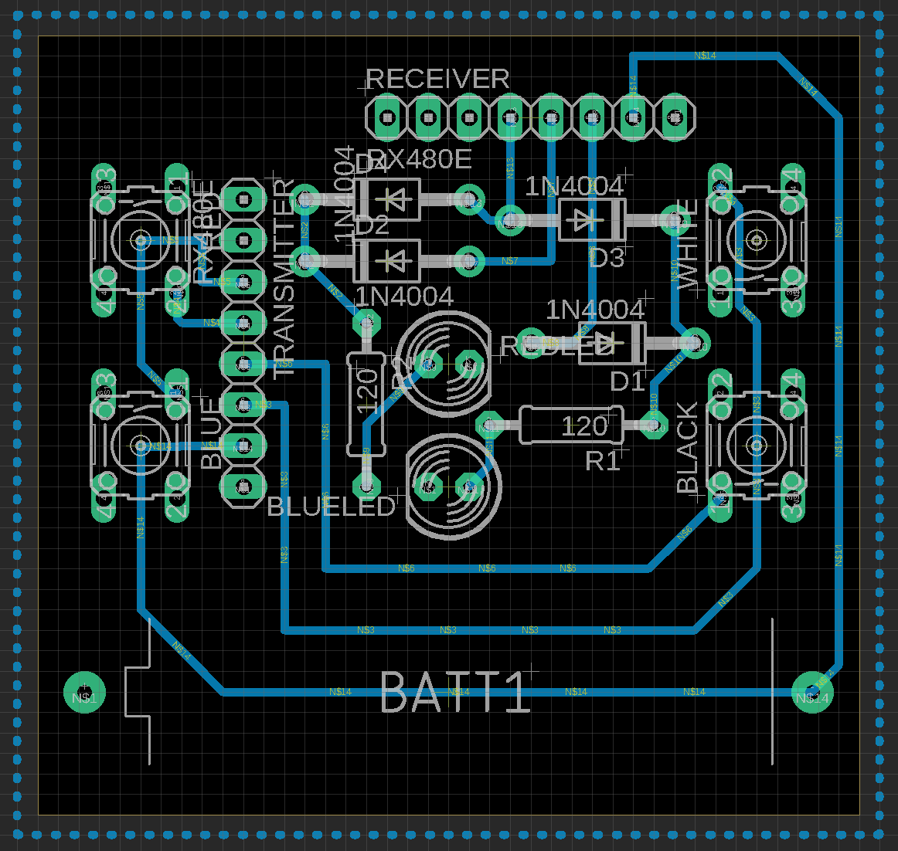
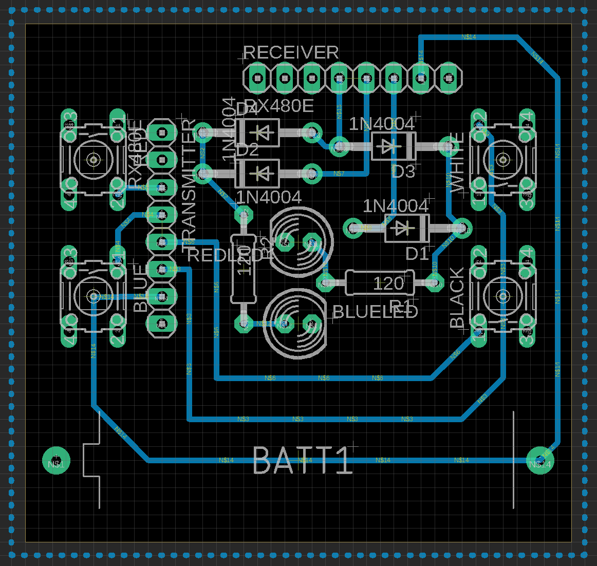

# Construction

Each token is represented by a PCB. As tokens are grouped in pairs, there are two different designs of PCBs.

Each PCB is assembled with one blue and one red LED, two resistors (120ohm), four diodes (1N5817), one radio transmitter and one receiver (QIACHIP RX480E), four push button switches, and one battery holder. Powered by a 3.7v Lithium battery (ICR 10440), a token simulates a bichromatic photon.

To achieve the effect of entanglement, the radio modules on both tokens need to be self-paired and cross-paired. In other words, the receiver on each token needs to learn both transimtters. Please refer to the user manual of the QIACHIP RX480E about procedures to pair the radio modules.

&copy; Avery Yang
